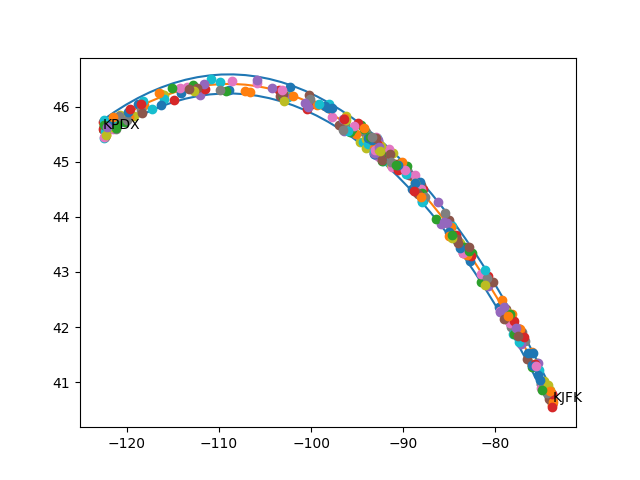

# From-To Planner for FSEconomy

## Intro
This is a basic flight planner when travelling from Point A to Point B 
in FSEconomy and your favorite flight simulator.  **This project was solely
to practise Python, SQLAlchemy ORM database modeling, and a simple greedy algorithm** for finding
the assignments to pick up along the way.  For this situation, it is inefficient
to use a database to store things such as assignments, but again, this was just practice.  
  
This is not the most efficient, or optimal, solution.  Use with discretion. 

### Overview
Two main classes for this project.  First one is `Flightpath` which takes as parameters the 'PointA'
 and the 'Point B' locations, along with the amount of nautical miles left and right of the direct path to allow for finding other
airports with assignments.  `Flightpath` allows exclusion of different types of airports in FSE, such as water airports, using the 
Keyword argument of `exclude` in a list or single string.  For example:
`exclude=['water', 'military']` or `exclude='water'`  
  
`Flightpath` uses ellipsoid calculations using the latitude and longitude of the airports
to create the shortest path.  For long distances, this will resemble a great cirlce arc.  
  
The other class is `FromToPlanner`.  This takes as parameters the `Flightpath`, along with the weight capacity
and passenger capacity of the plane you intend to fly.  This class uses a 
greedy algorithm to find the best way to make money on the travel over the flightpath.  
By "greedy", it means that the closest, highest paying assignments are chosen first. Subsequent
assignments are added if plane capacity allows.  This is NOT THE MOST OPTIMAL. In the FSE world, long
 distance assignements typically have a decreasing value per mile travelled.

## Requirements
This requires multiple packages.  I'll update the dependency list soon.

### config.py
A `config.py` file needs to be used to store your FSE access code along with MySQL username and password.  
An `sample_config.py` file has been provided.  Fill in the required values and rename this file `config.py`.  

## Results
The following is a example of flying from Portland, OR (KPDX) to JFK airport in New York, NY (KJFK):
```angular2html
<class 'src.assignment_planner.FromToPlanner'>:
From: KPDX, To: KJFK
Weight Capacity: 224
Passenger Capacity: 2

    Leg
    Depart: KPDX
    Land: 7OR6
    Number of Passengers: 2
    Payload: 154
        Assignment
        From: KPDX, To: 75WA
        Unit Type:passengers
        Amount: 1
        Pay:700.00
        Assignment
        From: KPDX, To: 7OR6
        Unit Type:passengers
        Amount: 1
        Pay:658.00
    Leg
    Depart: 7OR6
    Land: KTTD
    Number of Passengers: 1
    Payload: 77
        Assignment
        From: KPDX, To: 75WA
        Unit Type:passengers
        Amount: 1
        Pay:700.00
    Leg
    Depart: KTTD
    Land: 75WA
    Number of Passengers: 1
    Payload: 77
        Assignment
        From: KPDX, To: 75WA
        Unit Type:passengers
        Amount: 1
        Pay:700.00
    Leg
    Depart: 75WA
    Land: 4S2
    Number of Passengers: 0
    Payload: 0
    Leg
    Depart: 4S2
    Land: KTTD
    Number of Passengers: 2
    Payload: 154
        Assignment
        From: 4S2, To: KTTD
        Unit Type:passengers
        Amount: 2
        Pay:1010.00
...

Leg
    Depart: NK30
    Land: 6N7
    Number of Passengers: 1
    Payload: 77
        Assignment
        From: NK30, To: 6N7
        Unit Type:passengers
        Amount: 1
        Pay:264.00
    Leg
    Depart: 6N7
    Land: KJFK
    Number of Passengers: 0
    Payload: 0

Total Payout : 30028.00

```


